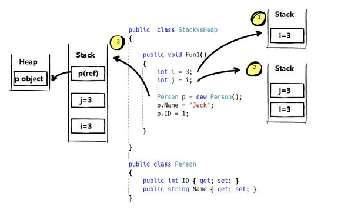

### 1、.NET变量在堆(Heap)和栈(Stack)中的保存
&emsp;&emsp;计算机的内存可以分为代码块内存，Stack内存和Heap内存。代码区是在加载程序时存放程序机器代码的地方。

&emsp;&emsp;栈是先进先出的线性结构，增长是向低地址扩展，最新压入栈的项被认为是在“栈的顶部”。当从栈中弹出一个项时，我们得到的是位于栈最顶部的那一个。由系统分配管理内存空间，一般保存值类型。堆是动态分配内存，内存大小不一，也不会自动释放，需要程序手动申请和释放空间。

&emsp;&emsp;若只是声明一个对象，则先在栈内存中为其分配地址空间，若再实例化它，则在堆内存中为其分配空间。string、object、class、delegate、interface是引用类型，其他的类型为数值类型

### 2、举个栗子说明变量在内存中的保存位置，如图



&emsp;&emsp;`StackVsHeap`类有一个Person类和Fun1方法，当调用Fun1方法，执行第一条语句
  
```Csharp
  int i=3;
```
&emsp;&emsp;int i=3; 是函数内的非静态变量，而数值类型为非引用类型，即会在Stack中分配一块区域来存放该变量的名和值。同理，执行第二条语句后，.net也会在Stack内存中分配一个区域来存放该变量的名和值。而且地址块在 i=3 上面(LIFO)。<br><br>

&emsp;&emsp;接下来实例化Person类
```csharp
  Person p = new Person();
```
  1. 在Stack上分配一个Person类型的p引用变量(指针)(指向Heap上的地址)
  2. 在Heap上分配一个空间来存储Person类的实例数据

### 3、值类型和引用类型
&emsp;&emsp;实例化p2

```csharp
  Person p2 = p;
  p2.ID=3;
```


&emsp;&emsp;p和p2共同指向同一个heap地址块，修改p2的值就会影响p的值
